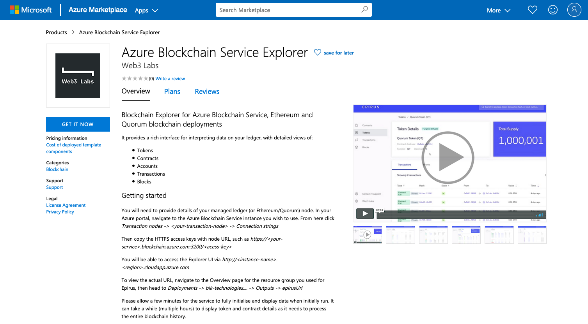

# Getting Started

Epirus supports a number of different hosting options which all come with support from the Web3 Labs team:

1. Cloud - you can find it in the [AWS](https://web3labs.com/aws-offer) and [Azure](https://web3labs.com/azure-offer) marketplaces
1. SaaS - we also provide a hosted or on-premise [Enterprise](#enterprise) version

There is also a basic [Free](#free) version.

This documentation reflects the features of our AWS, Azure and Enterprise versions.

## AWS

The [AWS Marketplace offer](https://web3labs.com/aws-offer) provides a pre-configured VM with 
Epirus already installed. It requires an active AWS subscription.


You will need to provide details of the RPC endpoint for your Hyperledger Besu/Quorum/Ethereum node. 

Then copy the HTTPS access keys with node URL, such as `http://<your-service>:8545`

Once the virtual machine has been deployed, launch a terminal on the machine. Then run the following command to configure the node:

```bash
$ sudo epirus init
Please enter node URL: http://<your-service>:8545
Successfully connected to http://<your-service>:8545
Configuration written to /usr/local/src/epirus/epirus.conf

You can then start the Epirus service:

$ sudo systemctl start epirus.service
```

You will be able to access the Explorer UI via `http://vm-ip-address-or-hostname`

Please allow a few minutes for the service to fully initialise and display data when initially run. It will automatically start up on subsequent reboots.


Please note, it can take a while (multiple hours) to display token and contract details as it needs to process the entire blockchain history.

## Azure

The [Azure Marketplace offer](https://web3labs.com/azure-offer) is the simplest full version of Epirus 
to get up and running with. It requires an active Azure cloud subscription



You will need to provide details of your managed ledger (or Ethereum/Quorum/Hyperledger Besu) node. In your Azure portal, navigate to the Azure Blockchain Service instance you wish to use. From here click `Transaction nodes -> <your-transaction-node> -> Connection strings`

Then copy the HTTPS access keys with node URL, such as `https://<your-service>.blockchain.azure.com:3200/<acess-key>`

You will be able to access the Explorer UI via `http://<instance-name>-<uuid>.<region>.cloudapp.azure.com`

To view the actual URL, navigate to the Overview page for the resource group you used for Epirus, then head to `Deployments -> blk-technologies.... -> Outputs -> epirusUrl`.

Please allow a few minutes for the service to fully initialise and display data when initially run. You will see the below loading screen while it is initially loading.


Please note, it can take a while (multiple hours) to display token and contract details as it needs to process the entire blockchain history.


## Enterprise

Web3 Labs also provides hosted Blockchain Explorer instances - these can be hosted within your cloud subscription or hosted by us.

Some of the features include:

- SSO authentication (Active Directory, SAML, Okta, etc)
- Dedicated database
- Data encryption at rest and in transit
- Continuous backup and point in time data recovery
- Full access to backups
- Tableau integration support 

For further information please [email us](mailto:hi@web3labs.com). 


## Free 

A free, feature limited version of Epirus is available [here](https://github.com/blk-io/epirus-free). This version is updated periodically, unlike the Azure and SaaS offerings which are constantly being updated with the latest features.
