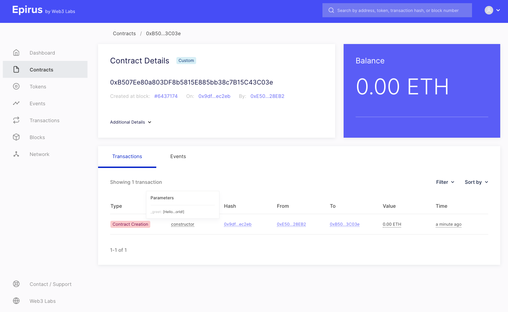
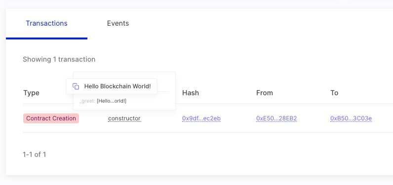
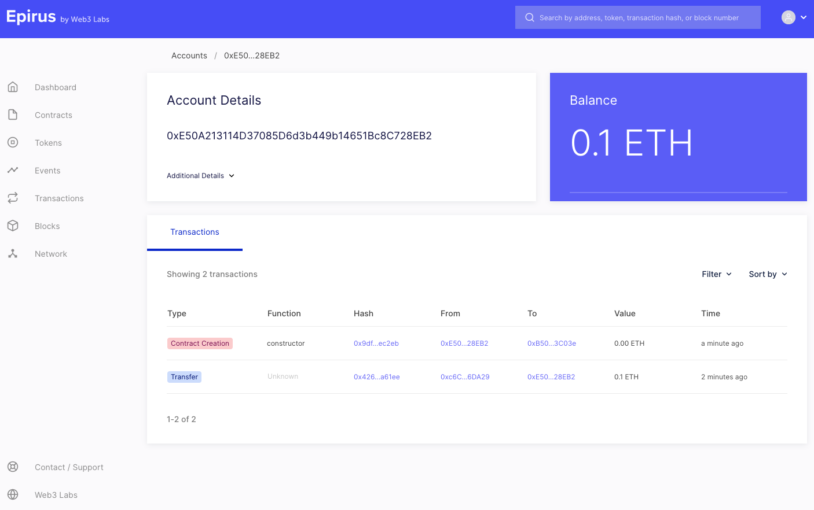
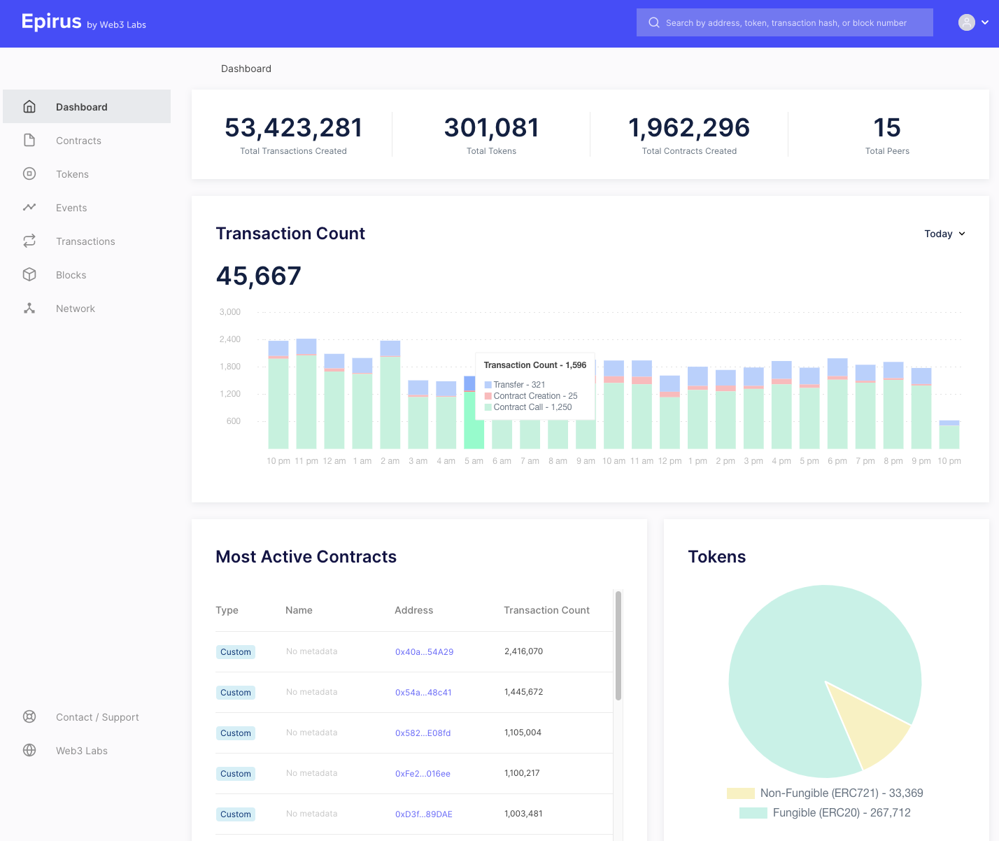

# QuickStart

The Epirus Platform consists of a suite of tools and services to enable rapid and efficent development, deployment and monitoring of blockchain applications.

All it takes is three commands to go from zero to having your first live blockchain application:

1. Install the Epirus SDK
1. Create your first applicaiton
1. Deploy your application

Read on to super-charge your blockchain journey!

## Installation

To install the Epirus CLI on your local Mac or Linux machine, run the following command in your terminal:

```
curl -L get.epirus.io | sh && source ~/.epirus/source.sh
```

For Windows, run the following in PowerShell:

```
Set-ExecutionPolicy Bypass -Scope Process -Force; iex ((New-Object System.Net.WebClient).DownloadString('https://raw.githubusercontent.com/epirus-io/epirus-installer/master/installer.ps1'))
```

Alternatively, you can head [here](https://github.com/epirus-io/epirus-cli/releases/latest) to download the latest release.

## Account Creation

If you signed up for Epirus via the [website](https://www.web3labs.com/epirus-platform) you should already have an account, if not you can create one via the CLI.

<video width="100%" controls>
   <source src="img/epirus-quickstart.webm" type="video/mp4">
</video>

In order to create a new account, use the command `epirus account create`, and enter your email address when prompted. You will be sent an activation email. 

Once your email address has been confirmed, you will have an account on the Epirus platform and will be able to make use of all features.

You will need to be logged in to deploy Epirus applications. Use `epirus login` and follow the prompt to do this.

## Project Creation

After having created a new account, use the command `epirus new` to create a new project. Epirus will use sensible defaults for all the questions asked during the project setup process, so if you hit enter on each question, the output should be similar to the following:

```
  ______       _                
 |  ____|     (_)               
 | |__   _ __  _ _ __ _   _ ___ 
 |  __| | '_ \| | '__| | | / __|
 | |____| |_) | | |  | |_| \__ \
 |______| .__/|_|_|   \__,_|___/
        | |                     
        |_|                     
Please enter the project name [Web3App]:

Please enter the package name for your project [io.epirus]:

Please enter the destination of your project [/home/user/Web3App]: 

[ \ ] Creating Web3App
Project Created Successfully

Project information
Wallet Address      0xd66aa9b52a33f0318fbe609142db46156c176c04

Commands
./gradlew run       Runs your application
./gradlew test      Test your application
epirus deploy       Deploys your application
```

Epirus has now created and built a full project, which includes a *Hello World* smart contract, and all the necessary code to interact with it, test it, and deploy it. 

## Deployment

Using the `epirus deploy` command, you will be able to deploy your code to the Rinkeby and Ropsten Ethereum test networks, from the wallet address that Epirus generated for you (this wallet will be automatically funded with testnet Ether by Epirus during the contract deploy process).

```
$ epirus deploy rinkeby
  ______       _                
 |  ____|     (_)               
 | |__   _ __  _ _ __ _   _ ___ 
 |  __| | '_ \| | '__| | | / __|
 | |____| |_) | | |  | |_| \__ \
 |______| .__/|_|_|   \__,_|___/
        | |                     
        |_|                     
Preparing to deploy your Web3App

Account status      ACTIVE 
Wallet balance      0.0984925612 ETH
Uploading metadata  DONE

Deploying your Web3App

Contract address    https://rinkeby.epirus.io/contracts/0xa12dda51eac72ffd6dc4f9ccc6fb6bbdd8b97892
Wallet address      https://rinkeby.epirus.io/accounts/0x1f17c4af8313f5923a05b1dc6c262bb0b9c90c27
```

Once completed you can use the provided links to examine your live blockchain application and account!

## Monitoring

Monitoring your application is achieved via the Epirus Explorer. 

Two URLs are output by the Epirus SDK `deploy` command following a successful deployment. They allow you to view details of the deployed smart contract and your Ethereum wallet account respectively.

If you head to the contract view, you can dig into details of your smart contract.



There will be a single transaction which was the transaction that deployed your contract.

If you hover over the `constructor` field you will see the Hello World message that was in your smart contract that has now been deployed to the globally decentralized public Ethereum network!



The other view provides details of all transactions associated with your recently created wallet file. This was created when you ran the `epirus new` command, and funded with the cryptocurrency Ether when you ran `epirus deploy`. This funding activity allows you to pay for transactions on the public Ethereum network.



Finally, click on the Dashboard link in Epirus Explorer to see an overview of the public Ethereum network your contract was deployed to.



You can learn more about the Epirus Explorer [here](/explorer).

## Next Steps

From here you'll probably want to start digging further through the project code created by the Epirus SDK. Read more [here](/sdk).
